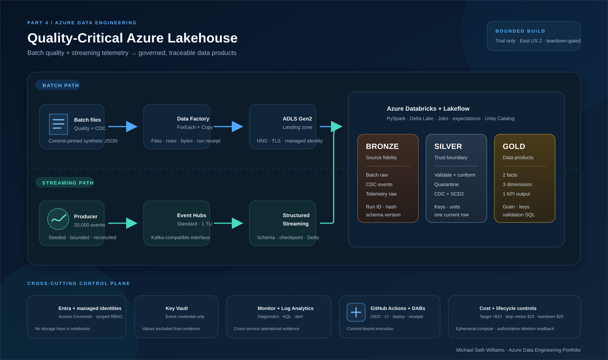

# Quality-Critical Azure Lakehouse

From batch and streaming telemetry to governed data products. This is an evidence-led Azure Data Engineering case study in which infrastructure, transformations, orchestration, recovery, performance, governance, cost, and teardown are independently inspectable.

> I engineered a reproducible Azure lakehouse that makes ingestion, quality, history, orchestration, recovery, performance, governance, monitoring, cost, and teardown independently inspectable.

[View the recruiter case study](https://smailliwhtes.github.io/quality-critical-azure-lakehouse/) · [Download the 32-page portfolio document](https://smailliwhtes.github.io/quality-critical-azure-lakehouse/downloads/part4-azure-data-engineering-portfolio.pdf) · [Inspect the evidence manifest](evidence/public/evidence_manifest.json)

## Engineering scope

`Bicep infrastructure as code` · `ADLS Gen2 medallion storage` · `Azure Data Factory batch ingestion` · `Event Hubs bounded streaming` · `PySpark and Delta Lake transformations` · `Lakeflow pipelines and Jobs` · `Unity Catalog governance and lineage` · `CDC and SCD Type 2 history` · `Failure repair and idempotency proof` · `Spark performance measurement` · `Azure Monitor and Log Analytics` · `OIDC-based CI/CD and exact-scope teardown`

## Business problem

Operations leaders need one trustworthy path from batch quality observations and sensor telemetry to traceable decisions, without hiding rejected data, history, failures, or operating cost.

The implementation answers four operational questions:

- Did each batch remain within quality and environmental limits?
- Which records failed validation, and why?
- What changed during the batch lifecycle?
- Can every published KPI be traced to source data and an executed pipeline?

## Evidence contract

Public claims use exactly three states:

- `VERIFIED`: executed in the stated Azure or Databricks environment and paired with sanitized platform evidence.
- `DEMONSTRATED`: executed deterministically outside the claimed cloud environment or validated as an implementation artifact.
- `PRODUCTION_BLUEPRINT`: designed and documented but not executed in this bounded portfolio environment.

The source of truth is [`evidence/public/evidence_manifest.json`](evidence/public/evidence_manifest.json). Every major verified claim binds a platform capture, code path, machine receipt, validation result, UTC time, execution commit, and SHA-256 hash.

## Deterministic data product

Seed: `20260812`

| Domain | Rows |
| --- | ---: |
| Quality observations | 30,000 |
| Telemetry records | 50,000 |
| Stream messages | 20,000 |
| Batches | 600 |
| Sites | 12 |
| Products | 20 |
| CDC changes | 48 |
| Reserved hard failures | 1 |

The fixture includes controlled duplicates, null and unknown business keys, malformed timestamps, impossible temperatures, inconsistent units, out-of-order CDC, schema evolution, and one isolated hard contract failure. The complete file and hash contract is [`data/synthetic/manifest.json`](data/synthetic/manifest.json).

## Gold data products

| Object | Grain |
| --- | --- |
| `fact_batch_quality` | One quality measurement for one batch characteristic at one observation time |
| `fact_cold_chain_excursion` | One detected environmental excursion episode per batch and sensor interval |
| `dim_batch_history` | One effective-dated version of a batch lifecycle record |
| `dim_site` | One operating site |
| `dim_product` | One manufactured product |
| `kpi_quality_summary` | One site, product, and reporting date |

Every Gold object also declares keys, upstream lineage, and executable validation SQL in [`sql/gold/table_contracts.yml`](sql/gold/table_contracts.yml) and [`sql/gold/validate_gold.sql`](sql/gold/validate_gold.sql).

## Architecture



- Batch: deterministic files → Azure Data Factory → ADLS Gen2 landing → Bronze.
- Streaming: bounded producer → Event Hubs → Structured Streaming → checkpointed Bronze Delta.
- Processing: reusable PySpark → Silver validation and quarantine → CDC/SCD2 → Gold products.
- Control plane: managed identities, Access Connector, Unity Catalog, Key Vault, Monitor, Log Analytics, GitHub Actions, budgets, and teardown verification.

## Reproduce locally

Prerequisites are Python 3.12, JDK 17, Node 24, Azure CLI with Bicep, and the Databricks CLI.

```powershell
uv venv --python 3.12 .venv
uv pip install --python .venv/Scripts/python.exe --editable ".[dev]"
npm ci
.venv/Scripts/python.exe -m pytest tests/unit tests/integration -q
.venv/Scripts/python.exe -m ruff check src tests pipelines
az bicep build --file infra/main.bicep
npm run check
```

Live deployment intentionally fails closed unless `PART4_BUDGET_USD` is numeric and within the approved limit. The workflow supports only `deploy-run-collect` and `teardown` operations.

## Cost and security boundaries

- Target: $10 incremental.
- Stop new compute or retries: $15.
- Immediate teardown: $20.
- Azure Databricks: Trial only; no paid Premium fallback.
- Identity: managed identities and federated CI authentication; no long-lived cloud password or Databricks token.
- Public evidence excludes secrets, connection strings, storage keys, account identifiers, tenant and subscription identifiers, and personal email addresses.
- Teardown scope: Only the isolated Part 4 resource group, its Databricks-managed resource group, and the Part 4 budget.

## Technical documentation

- [Architecture](docs/architecture.md)
- [Security](docs/security.md)
- [Data contracts](docs/data-contracts.md)
- [Quality rules](docs/quality-rules.md)
- [Runbook](docs/runbook.md)
- [Incident report](docs/incident-report.md)
- [Performance report](docs/performance-report.md)
- [Cost report](docs/cost-report.md)
- [Evidence methodology](docs/evidence-methodology.md)

## Current evidence boundary

Azure provisioning, scoped identity, ADF batch ingestion, Event Hubs streaming, Lakeflow orchestration and expectations, AUTO CDC, Unity Catalog governance and lineage, failure and focused repair, idempotent recovery, the six-run performance experiment, monitoring configuration, and OIDC-backed deployment validation are `VERIFIED` with sanitized artifacts. Cost remains `PENDING BILLING SETTLEMENT`; the administrative alert was enabled but did not fire; the Trial workspace exposed no Databricks ARM diagnostic category. Exact-scope teardown is `VERIFIED`: Azure authoritatively read back the isolated resource group, its Databricks-managed resource group, and the Part 4 budget as absent. No resource screenshot is treated as proof of workload execution.

The source planning document is private and is not included in this repository or its public metadata.
